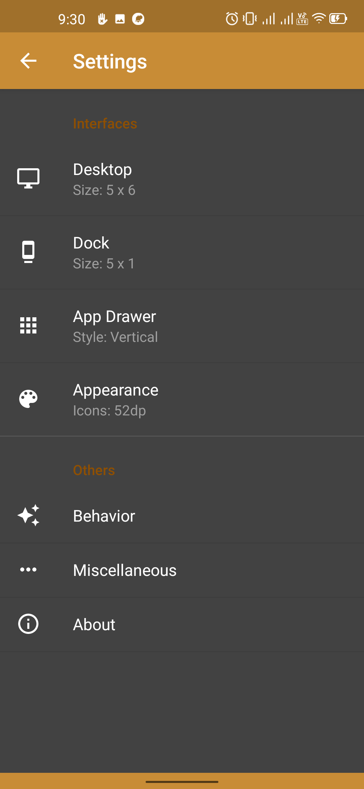

# Smart & Warm Launcher
A free and open source launcher for Android. It is a fork of Lawnchiar to continue development and add new features.  
Smart & Warm Launcher is a theme for android smartphone with features profession. It rated as one of the smartest and most perfect Launcher for mobiles.

## Screenshots *(Captures d'écran)*

## ⚡ Features

  * Paged desktop
  * Dock
  * Drag and drop
  * Hide apps
  * Scrollable background
  * Search bar
  * Icon packs

## Contributions

The project is always open for contributions and accepts pull requests. 

## Update from
[SmartCookieLauncher](https://github.com/CookieJarApps/SmartCookieLauncher)  
Thank you CookieJarApps

### License

This project is under the GNU-GPL 3.0

## Donate
If you like Smart & Warm Launcher be happy about a donation. You can either send bitcoin or donate via Paypal.

<table>
  <tr>
    <td></td>
    <td></td>
    <td><samp>bc1q8z8ec9m29revsvpe9wtyvnlnave3jjz8w47snd</samp></td>
  </tr>
  <tr>
    <td></td>
    <td></td>
    <td><a href="https://www.paypal.com/paypalme/vietnux">https://www.paypal.com/paypalme/vietnux</a></td>
  </tr>
</table>

Thank you!
